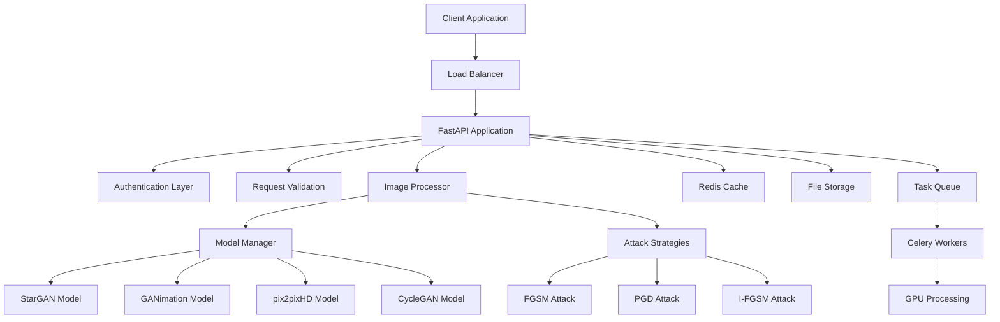
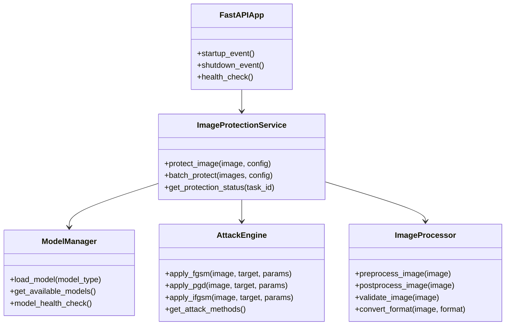
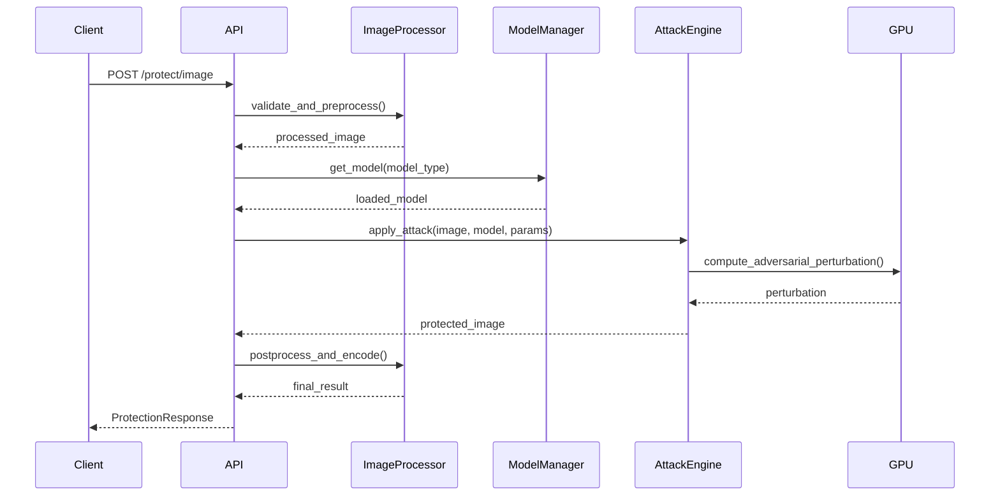
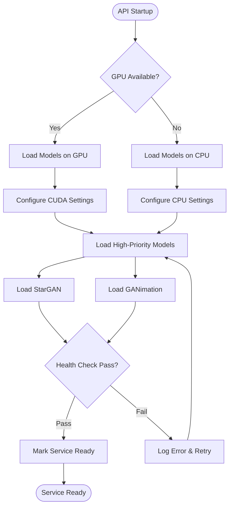

# Deepfake Protection API Design

## Overview

This design document outlines a FastAPI-based web service that provides deepfake protection capabilities by applying adversarial perturbations to input images. The API serves as a wrapper around the existing deepfake protection models (StarGAN, GANimation, pix2pixHD, CycleGAN) and their adversarial attack implementations.

**Core Value Proposition:**
- Protects images from unauthorized deepfake manipulation by applying imperceptible adversarial perturbations
- Provides a user-friendly REST API interface for the existing command-line deepfake protection tools
- Supports multiple attack strategies and model architectures
- Enables batch processing and real-time protection for images

## Technology Stack

- **Web Framework**: FastAPI
- **Deep Learning**: PyTorch
- **Image Processing**: Pillow (PIL), OpenCV
- **Async Processing**: asyncio, Celery (for heavy computations)
- **Validation**: Pydantic
- **Documentation**: OpenAPI/Swagger (auto-generated)
- **Containerization**: Docker
- **GPU Support**: CUDA-enabled PyTorch

## Architecture

### System Architecture



### Component Architecture



## API Endpoints Reference

### Core Protection Endpoints

#### POST /api/v1/protect/image
Applies adversarial protection to a single image.

**Request:**
```json
{
  "image": "base64_encoded_image_data",
  "model_type": "stargan|ganimation|pix2pixhd|cyclegan",
  "attack_method": "fgsm|pgd|ifgsm",
  "attack_params": {
    "epsilon": 0.05,
    "iterations": 10,
    "step_size": 0.01
  },
  "target_attributes": ["Black_Hair", "Male"],
  "output_format": "jpeg|png|webp"
}
```

**Response:**
```json
{
  "protected_image": "base64_encoded_protected_image",
  "perturbation_map": "base64_encoded_perturbation_visualization",
  "protection_metrics": {
    "l2_norm": 0.0234,
    "linf_norm": 0.0512,
    "ssim": 0.9876
  },
  "processing_time_ms": 1250,
  "model_used": "stargan",
  "attack_applied": "pgd"
}
```

#### POST /api/v1/protect/batch
Processes multiple images in batch mode.

**Request:**
```json
{
  "images": ["base64_image1", "base64_image2"],
  "protection_config": {
    "model_type": "stargan",
    "attack_method": "pgd",
    "attack_params": {
      "epsilon": 0.05,
      "iterations": 10
    }
  },
  "async_processing": true
}
```

**Response:**
```json
{
  "task_id": "uuid-task-identifier",
  "status": "queued|processing|completed|failed",
  "estimated_completion_ms": 5000,
  "images_count": 2
}
```

#### GET /api/v1/protect/status/{task_id}
Retrieves the status of a batch processing task.

**Response:**
```json
{
  "task_id": "uuid-task-identifier",
  "status": "completed",
  "progress": {
    "processed": 2,
    "total": 2,
    "percentage": 100
  },
  "results": [
    {
      "image_id": 0,
      "protected_image": "base64_data",
      "metrics": {...}
    }
  ],
  "processing_time_ms": 4850
}
```

### Model Management Endpoints

#### GET /api/v1/models
Lists available protection models and their status.

**Response:**
```json
{
  "models": [
    {
      "name": "stargan",
      "status": "loaded",
      "version": "v1.0",
      "capabilities": ["facial_attributes"],
      "supported_attacks": ["fgsm", "pgd", "ifgsm"],
      "memory_usage_mb": 2048
    }
  ]
}
```

#### POST /api/v1/models/{model_name}/load
Loads a specific model into memory.

#### POST /api/v1/models/{model_name}/unload
Unloads a model from memory to free resources.

### Configuration Endpoints

#### GET /api/v1/config/attack-methods
Lists available attack methods and their parameters.

**Response:**
```json
{
  "attack_methods": [
    {
      "name": "pgd",
      "description": "Projected Gradient Descent Attack",
      "parameters": {
        "epsilon": {"type": "float", "range": [0.01, 0.1], "default": 0.05},
        "iterations": {"type": "int", "range": [1, 50], "default": 10},
        "step_size": {"type": "float", "range": [0.001, 0.05], "default": 0.01}
      }
    }
  ]
}
```

## Data Models & Schema

### Request Models

```python
class ProtectionRequest(BaseModel):
    image: str = Field(..., description="Base64 encoded image data")
    model_type: ModelType = Field(default=ModelType.STARGAN)
    attack_method: AttackMethod = Field(default=AttackMethod.PGD)
    attack_params: AttackParams = Field(default_factory=AttackParams)
    target_attributes: Optional[List[str]] = None
    output_format: ImageFormat = Field(default=ImageFormat.JPEG)

class AttackParams(BaseModel):
    epsilon: float = Field(default=0.05, ge=0.01, le=0.1)
    iterations: int = Field(default=10, ge=1, le=50)
    step_size: float = Field(default=0.01, ge=0.001, le=0.05)
    random_start: bool = Field(default=True)

class BatchProtectionRequest(BaseModel):
    images: List[str] = Field(..., max_items=10)
    protection_config: ProtectionConfig
    async_processing: bool = Field(default=False)
```

### Response Models

```python
class ProtectionResponse(BaseModel):
    protected_image: str
    perturbation_map: Optional[str] = None
    protection_metrics: ProtectionMetrics
    processing_time_ms: int
    model_used: str
    attack_applied: str

class ProtectionMetrics(BaseModel):
    l2_norm: float
    linf_norm: float
    ssim: float
    psnr: float

class BatchTaskResponse(BaseModel):
    task_id: str
    status: TaskStatus
    estimated_completion_ms: Optional[int]
    images_count: int
```

### Enums

```python
class ModelType(str, Enum):
    STARGAN = "stargan"
    GANIMATION = "ganimation"
    PIX2PIXHD = "pix2pixhd"
    CYCLEGAN = "cyclegan"

class AttackMethod(str, Enum):
    FGSM = "fgsm"
    PGD = "pgd"
    IFGSM = "ifgsm"

class TaskStatus(str, Enum):
    QUEUED = "queued"
    PROCESSING = "processing"
    COMPLETED = "completed"
    FAILED = "failed"
```

## Business Logic Layer

### Image Protection Service



### Model Loading Strategy



## Core Attack Implementation Integration

### StarGAN Attack Integration

```python
class StarGANAttackService:
    def __init__(self, model_path: str, device: str):
        self.model = self._load_stargan_model(model_path)
        self.device = device
        
    def apply_protection(self, image: torch.Tensor, 
                        target_attributes: List[str],
                        attack_params: AttackParams) -> Tuple[torch.Tensor, torch.Tensor]:
        
        # Convert attributes to target vector
        c_trg = self._attributes_to_vector(target_attributes)
        
        # Create attack instance
        pgd_attack = LinfPGDAttack(
            model=self.model,
            device=self.device,
            epsilon=attack_params.epsilon,
            k=attack_params.iterations,
            a=attack_params.step_size
        )
        
        # Generate target for attack
        with torch.no_grad():
            target_output, _ = self.model(image, c_trg)
        
        # Apply adversarial perturbation
        protected_image, perturbation = pgd_attack.perturb(image, target_output, c_trg)
        
        return protected_image, perturbation
```

### Attack Method Factory

```python
class AttackFactory:
    @staticmethod
    def create_attack(attack_method: AttackMethod, 
                     model: torch.nn.Module,
                     device: str,
                     params: AttackParams) -> BaseAttack:
        
        if attack_method == AttackMethod.PGD:
            return LinfPGDAttack(
                model=model,
                device=device,
                epsilon=params.epsilon,
                k=params.iterations,
                a=params.step_size
            )
        elif attack_method == AttackMethod.FGSM:
            return LinfPGDAttack(
                model=model,
                device=device,
                epsilon=params.epsilon,
                k=1,  # Single iteration for FGSM
                a=params.epsilon
            )
        elif attack_method == AttackMethod.IFGSM:
            return LinfPGDAttack(
                model=model,
                device=device,
                epsilon=params.epsilon,
                k=params.iterations,
                a=params.step_size,
                rand=False  # No random start for I-FGSM
            )
```

## Image Processing Pipeline

### Input Processing

```mermaid
flowchart LR
    Input[Raw Image] --> Decode[Base64 Decode]
    Decode --> Validate[Format Validation]
    Validate --> Resize[Resize if Needed]
    Resize --> Normalize[Normalize [-1,1]]
    Normalize --> Tensor[Convert to Tensor]
    Tensor --> GPU[Move to GPU]
    GPU --> Ready[Ready for Attack]
```

### Output Processing

```mermaid
flowchart LR
    Protected[Protected Tensor] --> Clamp[Clamp Values]
    Clamp --> Denorm[Denormalize [0,255]]
    Denorm --> CPU[Move to CPU]
    CPU --> PIL[Convert to PIL]
    PIL --> Format[Apply Output Format]
    Format --> Encode[Base64 Encode]
    Encode --> Response[API Response]
```

## Performance Optimization

### Memory Management
- **Model Caching**: Keep frequently used models in GPU memory
- **Batch Processing**: Process multiple images together when possible
- **Memory Pooling**: Reuse tensor memory allocations
- **Garbage Collection**: Explicit cleanup of large tensors

### GPU Utilization
- **Async Processing**: Use asyncio for non-blocking operations
- **Stream Processing**: Utilize CUDA streams for parallel execution
- **Mixed Precision**: Use FP16 when available to reduce memory usage

### Caching Strategy
- **Result Caching**: Cache protection results for identical inputs
- **Model Weights**: Cache loaded model weights in Redis
- **Preprocessed Images**: Cache common preprocessing results

## Security Considerations

### Input Validation
- **File Size Limits**: Maximum 10MB per image
- **Format Restrictions**: Only allow JPEG, PNG, WebP
- **Dimension Limits**: Maximum 2048x2048 pixels
- **Content Validation**: Basic image integrity checks

### Rate Limiting
- **Per-User Limits**: 100 requests per hour for free tier
- **IP-based Limits**: 1000 requests per hour per IP
- **Burst Protection**: Maximum 10 concurrent requests per user

### Authentication & Authorization
- **API Key Authentication**: Required for all endpoints
- **Role-based Access**: Different limits for different user tiers
- **Usage Tracking**: Monitor and log all API usage

## Error Handling

### Error Categories

```python
class ProtectionError(Exception):
    """Base exception for protection operations"""
    
class ModelLoadError(ProtectionError):
    """Model loading failed"""
    
class ImageProcessingError(ProtectionError):
    """Image processing failed"""
    
class AttackGenerationError(ProtectionError):
    """Adversarial attack generation failed"""
    
class GPUMemoryError(ProtectionError):
    """Insufficient GPU memory"""
```

### Error Response Format

```json
{
  "error": {
    "code": "MODEL_LOAD_FAILED",
    "message": "Failed to load StarGAN model",
    "details": {
      "model_type": "stargan",
      "error_type": "memory_error"
    },
    "request_id": "uuid",
    "timestamp": "2024-01-15T10:30:00Z"
  }
}
```

## Testing Strategy

### Unit Testing
- **Attack Implementation Tests**: Verify adversarial perturbation generation
- **Image Processing Tests**: Test preprocessing and postprocessing pipelines
- **Model Loading Tests**: Verify model initialization and health checks
- **API Endpoint Tests**: Test all REST endpoints with various inputs

### Integration Testing
- **End-to-End Protection**: Full pipeline from image input to protected output
- **Multi-Model Testing**: Verify all supported models work correctly
- **Batch Processing**: Test batch operations and async processing
- **Error Scenarios**: Test error handling and recovery mechanisms

### Performance Testing
- **Load Testing**: Test with multiple concurrent users
- **Memory Testing**: Monitor GPU and system memory usage
- **Latency Testing**: Measure response times for different image sizes
- **Throughput Testing**: Maximum requests per second capacity

### Test Data
- **Sample Images**: Curated dataset of test images
- **Edge Cases**: Very small, very large, corrupted images
- **Format Variations**: Different image formats and color spaces
- **Attack Effectiveness**: Verify protection actually works against deepfakes